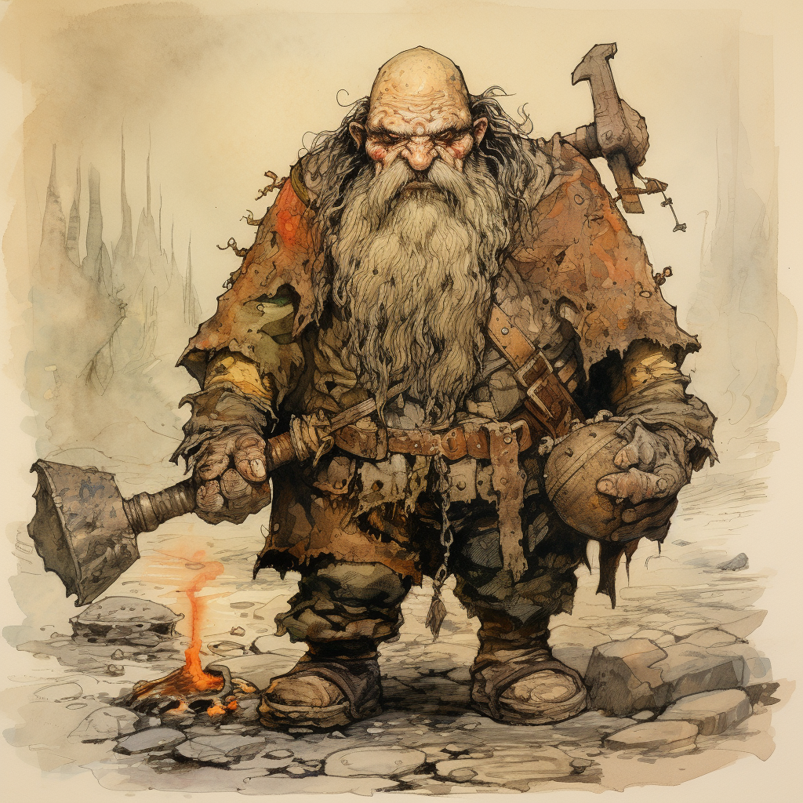

# Drunken Dwarves
Everyone needs mates.
## Table of Contents
1. [Introduction](#introduction)
2. [Thought Process](#thought-process)
3. [Workflow](#workflow)
4. [Testing](#testing)
5. [Installing](#installing)

## Introduction
I needed a way to start generating names, lots of names, names that almost tell a story in one line.
This is all for a small homebrew game I am working on. Also, it has proven to be a great way to upskill and
learn to hack with python and natural language processing. In particular using [NLTK](https://www.nltk.org/index.html)

## Thought Process
I wanted my names to be as unique as possible. I wanted simple solutions to generate them on mass without having to do
much preparation other than using some automation to clean, tidy data and then not have to  edit or manipulate 
afterwords and produced in a format that could be easily used by other parts of the program.

I spent quite a bit of time thinking about how to create pronounceable (for the most part) names. Probably not my idea,
but I did no research beforehand to see how others were making random name generators. My solution was to separate 
words into their syllables then use rand to rearrange into a new word.

## Workflow

> It's all about the syllables, lots of syllables. Mensdrusfon Bendharsohn the Apocalyptical

First problem how best to come up with lots and lots of syllables. Syllables should be pronounceable as they 
are the building blocks of words. Enter NLTK.

## Testing
tbd
## Installing
tbd